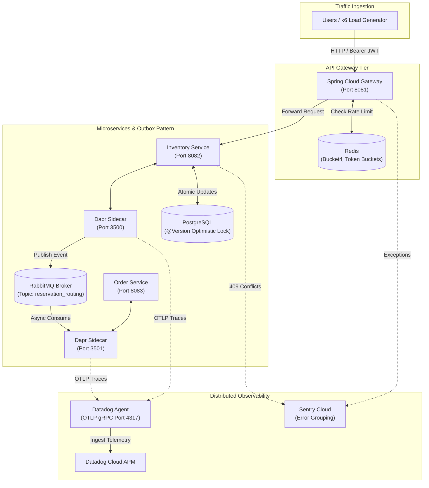
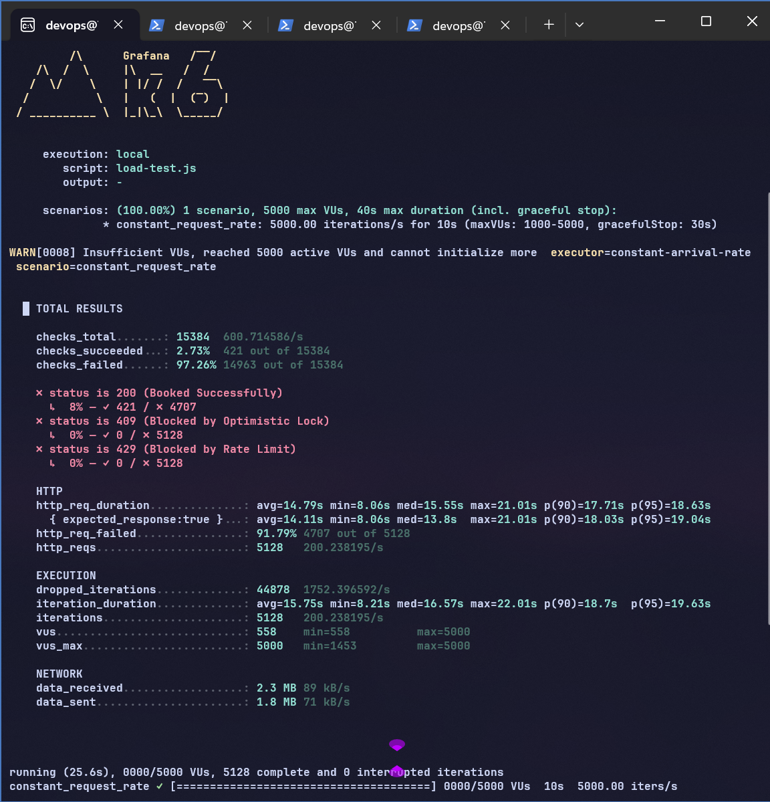
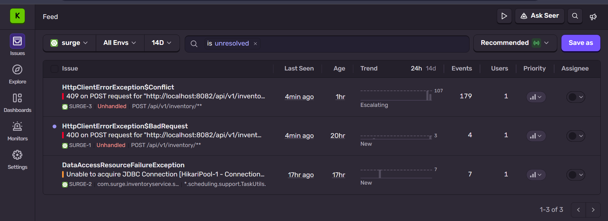
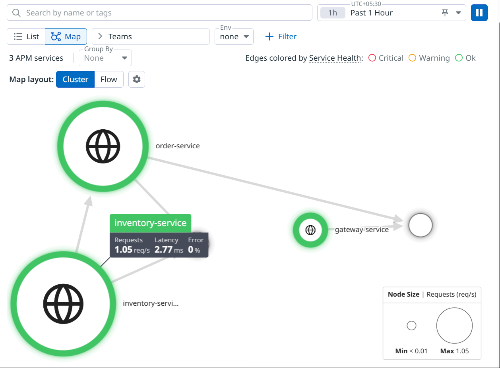
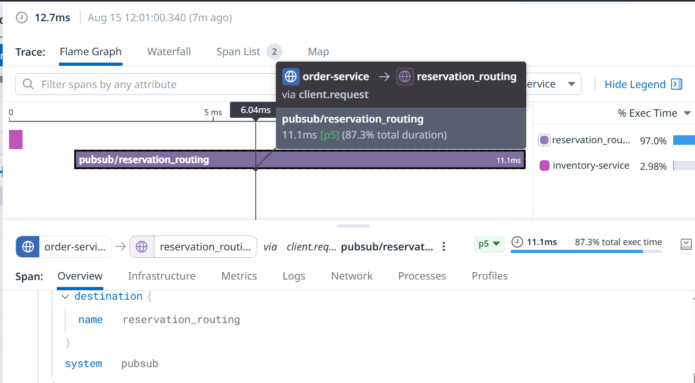

# SURGE: High-Concurrency Distributed Reservation Engine 🚀

SURGE is an enterprise-grade backend architecture engineered to handle massive throughput spikes ("Flash Sales"). It leverages distributed observability, asynchronous message routing, and database-level locking to guarantee data integrity and prevent race conditions during extreme-concurrency ticket reservation events.

---

## 🏗️ System Architecture

---

## ⚡ The Engineering Challenge: "Flash Sale" Chaos
When a high-demand event opens, thousands of users hit the API at the exact same millisecond trying to reserve the same limited resource. Standard synchronous architectures fail under this load, resulting in double-booking (race conditions), database deadlocks, and cascading service failures.

## 🛡️ Architecture & Core Defenses
This project solves the high-concurrency problem by implementing strict rate limiting at the API Gateway and **Optimistic Locking** at the database tier:

*   **API Gateway (Spring Cloud):** Utilizes **Bucket4j** and Redis for distributed rate limiting, dropping malicious traffic before it reaches downstream services.
*   **Database Integrity:** Implements **PostgreSQL + JPA `@Version` Optimistic Locking** to guarantee absolute data consistency when concurrent threads compete for the same database row.
*   **Asynchronous Decoupling:** Uses the **Transactional Outbox Pattern** with **Dapr** and **RabbitMQ** to decouple the reservation logic from order processing, ensuring sub-millisecond execution.
*   **Distributed Tracing:** Fully instrumented with **OpenTelemetry (OTLP)**, streaming spans to **Datadog APM** for real-time visualization of asynchronous service hops.

## 🛠️ Tech Stack
*   **Backend:** Java 21, Spring Boot 3, Spring Cloud Gateway
*   **Infrastructure:** PostgreSQL, Redis, RabbitMQ, Docker Compose
*   **Sidecar / Messaging:** Dapr (Distributed Application Runtime)
*   **Observability:** Datadog (APM & OpenTelemetry), Sentry (Error Tracking)
*   **Stress Testing:** Grafana k6

---

## 📊 Proof of Scale (5,000 RPS Stress Benchmark)
To validate the architecture's resilience, the system was subjected to a `k6` stress test simulating an instant surge of 5,000 requests per second. The API Gateway rate limiter was temporarily bypassed to intentionally stress the PostgreSQL database and connection pools.

### 1. Traffic Generation (k6)
The system was hit with a sustained load of 5,000 requests per second. The volume of concurrent connections pushed the local runtime and Hikari connection pools to their limits, simulating a real-world flash sale traffic spike.

  

### 2. Race Condition Prevention (Sentry Diagnostics)
Under extreme concurrency, threads attempting to modify the same ticket row trigger an `ObjectOptimisticLockingFailureException`. Sentry captured and grouped 179 conflict events, mathematically proving the database lock intercepted race conditions before any double-booking could occur.

  

### 3. Real-Time Topology Mapping (Datadog APM)
OpenTelemetry captured the complete lifecycle of incoming HTTP requests and asynchronous RabbitMQ message handoffs. Datadog dynamically mapped the service topology based entirely on the ingested OTLP spans.

  

### 4. Asynchronous Pub/Sub Latency Profiling
The Datadog Flame Graph demonstrates the Dapr sidecar successfully injecting trace headers into RabbitMQ. Despite the heavy load, the `pubsub/reservation_routing` execution time remained at 11.1 milliseconds.

  

---

## 👨‍💻 Author
**Shaik Karimullah**
 
*Computer Science Engineering*
